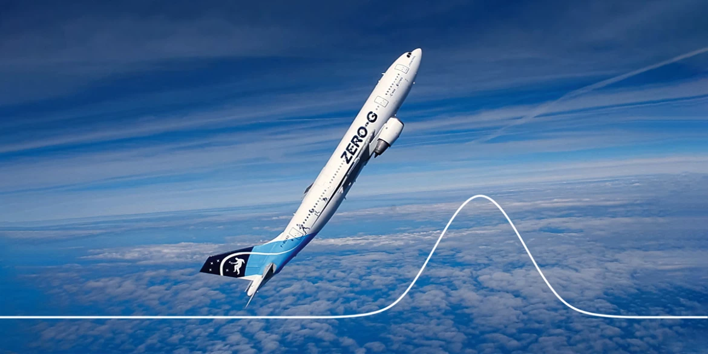

# The Brain in Zero-Gravity (Parabolic Flight)

## Introduction 
Ground-based spaceflight analogs have been developed by space agencies over time to overcome the limits of researching astronauts going on missions to space. Parabolic flight is a spaceflight analog and is the only way to create true microgravity on Earth. It is a highly used platform to study the acute consequences of microgravity. Our group's previous parabolic flight project in 2015-2016 revealed that the right angular gyrus of the brain exhibited altered functional connectivity within the brain after such a flight. This region is involved in spatial cognition, such as verticality perception. We now aim to extend the previous study by (i) implementing a verticality detection task and (ii) recording electroencephalography (EEG) data during flight, in addition to MRI acquisitions pre- and postflight. The goal is to verify and better understand the change occurring in the right angular gyrus and its relation to verticality perception.

This repository contains the codes related to the Oddball experiment, preprocessing, and data analysis of the study. 

In the cognitive task, there are always two different blocks: 
  - Main
  - Control
    
In the `Main` block, participants are asked to respond to the verticality of the stimuli. However, in the `Control` block, participants are asked to respond to the color of the stimuli. 

## Behavioural
In the behavioral paradigm, the procedure is as follows: 
  - `Main` and `Control` blocks while the participant lays down.
  - `Main` and `Control` blocks while the participant sits down.
  - Applying tDCS
  - `Main` and `Control` blocks while the participant sits down.

The order of the blocks and possible positions are randomized for each participant. The session after the tDCS is always in the sit-down position. 

In each block, 270 stimuli are presented (60 deviant, 210 standard). 

To run the experiment, you need to run the `VDT_BEH.py` file in the `./Codes/Behavioural` directory.  

## EEG 
The EEG paradigm was designed to be used inside an airplane during a parabolic flight. The flight consisted of 6 blocks, each containing 5 parabolas. We used the first 5 blocks to run the experiment. The EEG paradigm was also designed to consist of 5 blocks (1 `Rest`, 2 `VDT`, and 2 `Control`). The first block was always the `rest` paradigm. In the other four blocks, the `VDT` and the `control` paradigms were presented in a randomized order for each participant. Each block consisted of 5 runs running in each parabola. In each run, 18 stimuli were presented (4 deviant, 14 standard).

To run the experiment, you need to run the `VDT_EEG.py` file in the `./Codes/EEG/task_codes` directory. 

## fMRI 
The fMRI paradigm was used in a 3T Siemens scanner with a repetition time of TR = 1 second before and after the flight.  

The paradigm consisted of 16 blocks (8 `VDT` and 8 `Control`), presented randomly for each participant. Each block consisted of a total of 18 trials: 4 deviant and 14 standard. Each trial lasted 1 second. There was an inter-trial interval of 1 second accompanied by a random jitter. The jitters were produced in a pseudorandom manner to keep the length of the blocks consistent and equal to 36 seconds. The jitters were chosen from the range of -100ms to 100ms with 10ms steps in a way that they sum up to zero.

The task presentation codes can be found in the `VDT_fMRI.py` file in the `./Codes/fMRI/task/VDT_fMRI.py` directory. 
